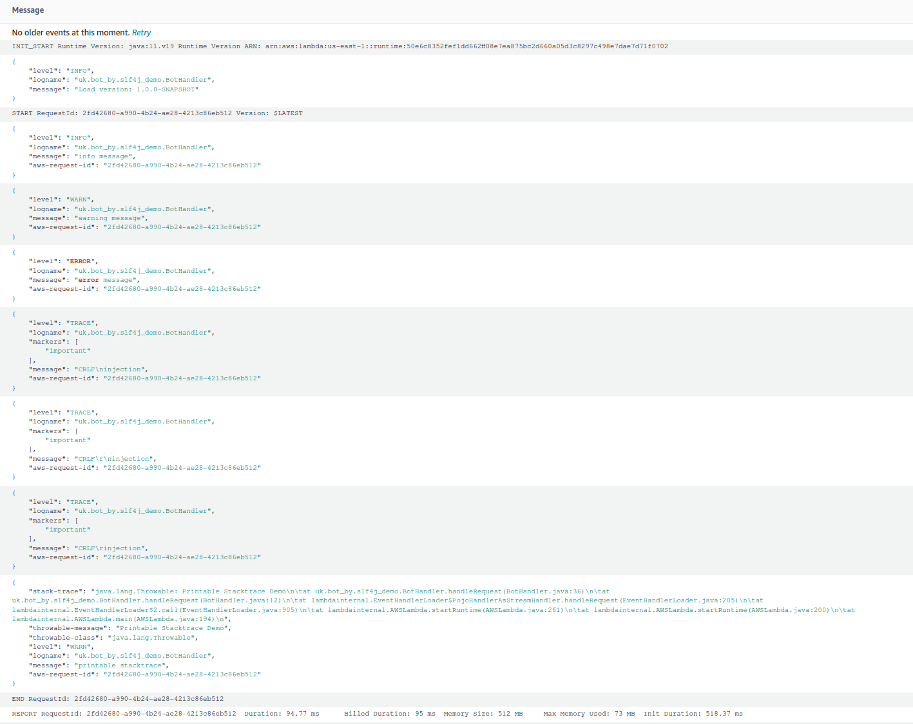

# Demo AWS Lambda with SLF4J, JSON Output

## Usage

1. Build and deploy it to AWS. See the section [Deploy to Lambda][deploy-lambda] or do it manually.
2. Run a test event.

The expected log lines

```json
{
  "level":"INFO",
  "logname":"uk.bot_by.slf4j_demo.BotHandler",
  "message":"info message",
  "aws-request-id":"2fd42680-a990-4b24-ae28-4213c86eb512"
}
{
  "level":"WARN",
  "logname":"uk.bot_by.slf4j_demo.BotHandler",
  "message":"warning message",
  "aws-request-id":"2fd42680-a990-4b24-ae28-4213c86eb512"
}
{
  "level":"ERROR",
  "logname":"uk.bot_by.slf4j_demo.BotHandler",
  "message":"error message",
  "aws-request-id":"2fd42680-a990-4b24-ae28-4213c86eb512"
}
{
  "level":"TRACE",
  "logname":"uk.bot_by.slf4j_demo.BotHandler",
  "markers":[
    "important"
  ],
  "message":"CRLF\ninjection",
  "aws-request-id":"2fd42680-a990-4b24-ae28-4213c86eb512"
}
{
  "level":"TRACE",
  "logname":"uk.bot_by.slf4j_demo.BotHandler",
  "markers":[
    "important"
  ],
  "message":"CRLF\r\ninjection",
  "aws-request-id":"2fd42680-a990-4b24-ae28-4213c86eb512"
}
{
  "level":"TRACE",
  "logname":"uk.bot_by.slf4j_demo.BotHandler",
  "markers":[
    "important"
  ],
  "message":"CRLF\rinjection",
  "aws-request-id":"2fd42680-a990-4b24-ae28-4213c86eb512"
}
{
  "stack-trace":"java.lang.Throwable: Printable Stacktrace Demo\n\tat uk.bot_by.slf4j_demo.BotHandler.handleRequest(BotHandler.java:36)...",
  "throwable-message":"Printable Stacktrace Demo",
  "throwable-class":"java.lang.Throwable",
  "level":"WARN",
  "logname":"uk.bot_by.slf4j_demo.BotHandler",
  "message":"printable stacktrace",
  "aws-request-id":"2fd42680-a990-4b24-ae28-4213c86eb512"
}
```

The screenshot of CloudWatch log


[deploy-lambda]: https://github.com/davidmoten/aws-maven-plugin#deploy-to-lambda
