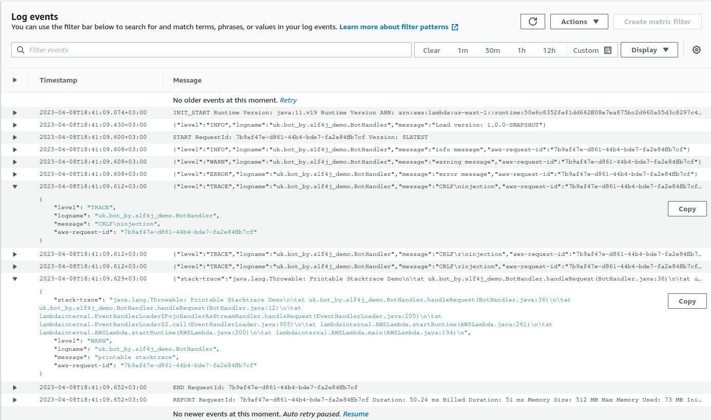

# Demo AWS Lambda with SLF4J, JSON Output

## Usage

1. Build and deploy it to AWS. See the section [Deploy to Lambda][deploy-lambda] or do it manually.
2. Run a test event.

The expected log lines

```json
{
    "level": "INFO",
    "logname": "uk.bot_by.slf4j_demo.BotHandler",
    "message": "info message",
    "aws-request-id": "7b9af47e-d861-44b4-bde7-fa2e84ffb7cf"
}
{
    "level": "WARN",
    "logname": "uk.bot_by.slf4j_demo.BotHandler",
    "message": "warning message",
    "aws-request-id": "7b9af47e-d861-44b4-bde7-fa2e84ffb7cf"
}
{
    "level": "ERROR",
    "logname": "uk.bot_by.slf4j_demo.BotHandler",
    "message": "error message",
    "aws-request-id": "7b9af47e-d861-44b4-bde7-fa2e84ffb7cf"
}
{
    "level": "TRACE",
    "logname": "uk.bot_by.slf4j_demo.BotHandler",
    "message": "CRLF\ninjection",
    "aws-request-id": "7b9af47e-d861-44b4-bde7-fa2e84ffb7cf"
}
{
    "level": "TRACE",
    "logname": "uk.bot_by.slf4j_demo.BotHandler",
    "message": "CRLF\r\ninjection",
    "aws-request-id": "7b9af47e-d861-44b4-bde7-fa2e84ffb7cf"
}
{
    "level": "TRACE",
    "logname": "uk.bot_by.slf4j_demo.BotHandler",
    "message": "CRLF\rinjection",
    "aws-request-id": "7b9af47e-d861-44b4-bde7-fa2e84ffb7cf"
}
{
    "stack-trace": "java.lang.Throwable: Printable Stacktrace Demo\n\tat uk.bot_by.slf4j_demo.BotHandler.handleRequest(BotHandler.java:36)\n\tat uk.bot_by.slf4j_demo.BotHandler.handleRequest(BotHandler.java:12)\n\tat lambdainternal.EventHandlerLoader$PojoHandlerAsStreamHandler.handleRequest(EventHandlerLoader.java:205)\n\tat lambdainternal.EventHandlerLoader$2.call(EventHandlerLoader.java:905)\n\tat lambdainternal.AWSLambda.startRuntime(AWSLambda.java:261)\n\tat lambdainternal.AWSLambda.startRuntime(AWSLambda.java:200)\n\tat lambdainternal.AWSLambda.main(AWSLambda.java:194)\n",
    "level": "WARN",
    "logname": "uk.bot_by.slf4j_demo.BotHandler",
    "message": "printable stacktrace",
    "aws-request-id": "7b9af47e-d861-44b4-bde7-fa2e84ffb7cf"
}
```

The screenshot of CloudWatch log


[deploy-lambda]: https://github.com/davidmoten/aws-maven-plugin#deploy-to-lambda
