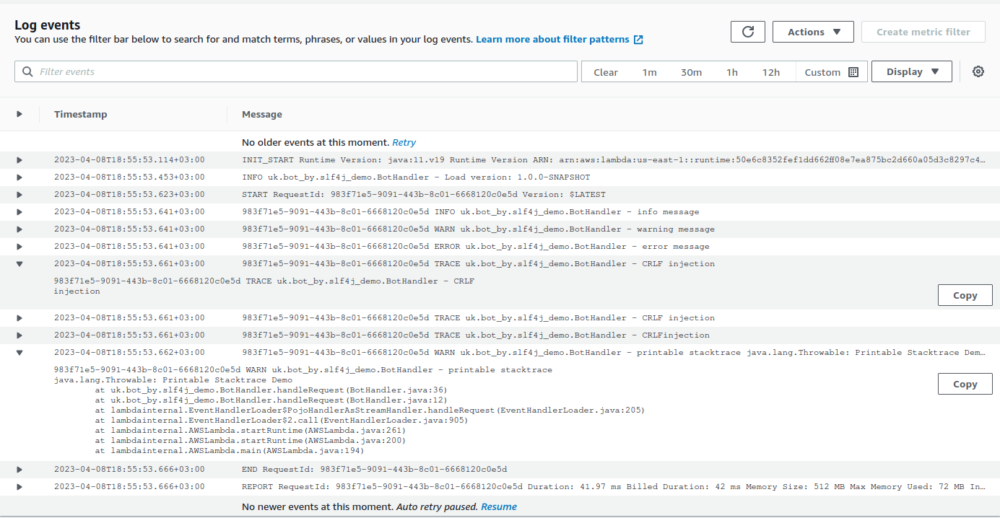

# Demo AWS Lambda with SLF4J

## Usage

1. Build and deploy it to AWS. See the section [Deploy to Lambda][deploy-lambda] or do it manually.
2. Run a test event.

The expected log lines

```log
983f71e5-9091-443b-8c01-6668120c0e5d INFO uk.bot_by.slf4j_demo.BotHandler - info message
983f71e5-9091-443b-8c01-6668120c0e5d WARN uk.bot_by.slf4j_demo.BotHandler - warning message
983f71e5-9091-443b-8c01-6668120c0e5d ERROR uk.bot_by.slf4j_demo.BotHandler - error message
983f71e5-9091-443b-8c01-6668120c0e5d TRACE uk.bot_by.slf4j_demo.BotHandler - CRLF
injection
983f71e5-9091-443b-8c01-6668120c0e5d TRACE uk.bot_by.slf4j_demo.BotHandler - CRLF
injection
983f71e5-9091-443b-8c01-6668120c0e5d TRACE uk.bot_by.slf4j_demo.BotHandler - CRLF
injection
983f71e5-9091-443b-8c01-6668120c0e5d WARN uk.bot_by.slf4j_demo.BotHandler - printable stacktrace
java.lang.Throwable: Printable Stacktrace Demo
	at uk.bot_by.slf4j_demo.BotHandler.handleRequest(BotHandler.java:36)
	at uk.bot_by.slf4j_demo.BotHandler.handleRequest(BotHandler.java:12)
	at lambdainternal.EventHandlerLoader$PojoHandlerAsStreamHandler.handleRequest(EventHandlerLoader.java:205)
	at lambdainternal.EventHandlerLoader$2.call(EventHandlerLoader.java:905)
	at lambdainternal.AWSLambda.startRuntime(AWSLambda.java:261)
	at lambdainternal.AWSLambda.startRuntime(AWSLambda.java:200)
	at lambdainternal.AWSLambda.main(AWSLambda.java:194)
```

The screenshot of CloudWatch log


[deploy-lambda]: https://github.com/davidmoten/aws-maven-plugin#deploy-to-lambda
