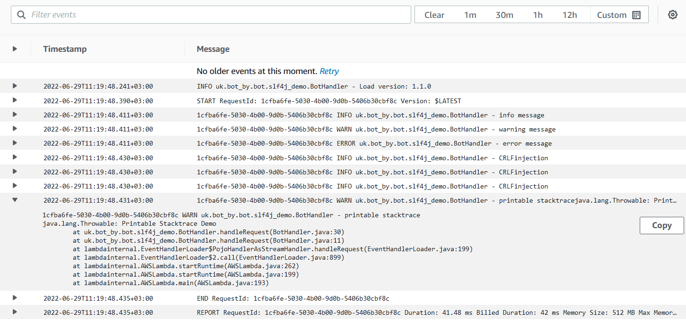

The expected log lines

```log
INFO uk.bot_by.bot.slf4j_demo.BotHandler - Load version: 1.1.0
START RequestId: 1cfba6fe-5030-4b00-9d0b-5406b30cbf8c Version: $LATEST
1cfba6fe-5030-4b00-9d0b-5406b30cbf8c INFO uk.bot_by.bot.slf4j_demo.BotHandler - info message
1cfba6fe-5030-4b00-9d0b-5406b30cbf8c WARN uk.bot_by.bot.slf4j_demo.BotHandler - warning message
1cfba6fe-5030-4b00-9d0b-5406b30cbf8c ERROR uk.bot_by.bot.slf4j_demo.BotHandler - error message
1cfba6fe-5030-4b00-9d0b-5406b30cbf8c INFO uk.bot_by.bot.slf4j_demo.BotHandler - CRLF injection
1cfba6fe-5030-4b00-9d0b-5406b30cbf8c INFO uk.bot_by.bot.slf4j_demo.BotHandler - CRLF injection
1cfba6fe-5030-4b00-9d0b-5406b30cbf8c INFO uk.bot_by.bot.slf4j_demo.BotHandler - CRLF injection
1cfba6fe-5030-4b00-9d0b-5406b30cbf8c WARN uk.bot_by.bot.slf4j_demo.BotHandler - printable stacktrace java.lang.Throwable: Printable Stacktrace Demo  at ...
END RequestId: 1cfba6fe-5030-4b00-9d0b-5406b30cbf8c
```

The screenshot of CloudWatch log

